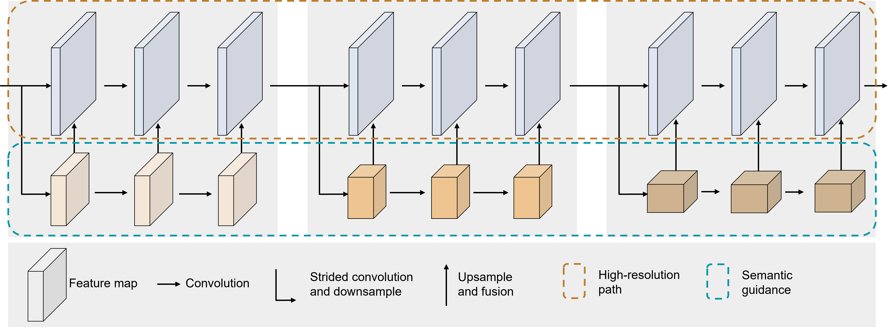
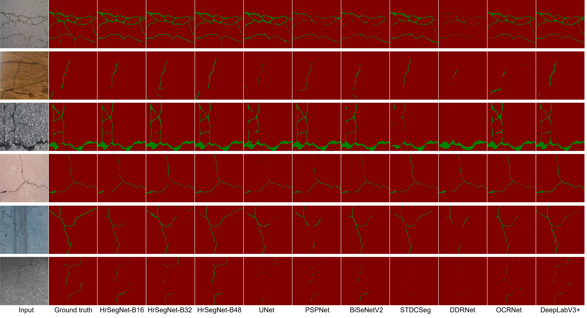

# HrSegNet4CrackSegmentation
Real-time High-Resolution Neural Network with Semantic Guidance for Crack Segmentation

# Abs
The current trend in crack detection methods is leaning towards the use of machine learning or deep learning. This is because deep learning-based methods can autonomously extract features from images, thereby avoiding the low stability caused by manually designed operators. However, there are still some problems with the current deep learning-based crack segmentation algorithms. Firstly, the vast majority of research is based on the modification and improvement of commonly used scene segmentation algorithms, with no specifically designed for crack segmentation tasks. Secondly, crack detection is increasingly reliant on edge devices, such as drones and vehicle-mounted cameras. Therefore, the model must be lightweight to achieve real-time segmentation efficiency. However, there is currently limited research in this area. We propose a high-resolution neural network with semantic guidance for real-time crack segmentation, named HrSegNet.
### Model Architecture  

### [Seg-Grad-CAM](https://arxiv.org/abs/2002.11434)  

### Comparisons with state-of-the-art

# Data
The data we have utilized is derived from two separate studies, namely: [CrackSeg9k](https://github.com/Dhananjay42/crackseg9k) and [KhanCrack](https://github.com/khanhha/crack_segmentation).

# Installation
The code requires python>=3.8, as well as paddle=2.4.1 and paddleseg=2.7.0 and OpenCV= 4.7.0. You can follow the instructions [paddle](https://github.com/PaddlePaddle/Paddle) and [paddleseg](https://github.com/PaddlePaddle/PaddleSeg) to install all the dependencies. If you need to reproduce the results, you have to install paddle with CUDA support.

# Usage
Once paddle and paddleseg are installed, you can use our published models very easily.  

We start by describing the contents of each directory. The directory `hrsegnet` defines the high-resolution crack segmentation model we designed, the three model files are almost identical except for the parameter `base`. The directory `participated_models` contains the models we compared in our experiments. The directory `configs` is the configuration files for all models, i.e. the details of all training and testing parameters.  

The easiest way to use our models is to use [paddleseg](https://github.com/PaddlePaddle/PaddleSeg). One can put the files of the desired models into the models directory of paddleseg, registering the model using `@manager.MODELS.add_component`. For training the model use the configuration files in the `configs` we provide. 

For datasets, we provide [CrackSeg9k](https://github.com/Dhananjay42/crackseg9k)  and [KhanCrack](https://github.com/khanhha/crack_segmentation) for [download](https://chdeducn-my.sharepoint.com/:u:/g/personal/2018024008_chd_edu_cn/EaeIccN1d9lMj5hVXJ1J7V8Bh2eQqGbX0w3CLh74QIGnfQ?e=7GmJXq). Also, in order that one can reproduce our results, we provide files for both training, validation, and test sets in `data`.

# Model
We expose all our models as TensorRT, including SOTA for comparison in all experiments. Note that all inputs to the TensorRT engine are **1 × 3 × 400 × 400**. We use TensorRT 8.6.1.
| Model |
| --- |
| [U-Net](https://chdeducn-my.sharepoint.com/:u:/g/personal/2018024008_chd_edu_cn/EYoEi_aQczxOswVyAi8FQBgBYSYXalI8oZKRszWHgbzZwg?e=XuFGzf) |
| [DDRNet](https://chdeducn-my.sharepoint.com/:u:/g/personal/2018024008_chd_edu_cn/EX-QSVExyFVLvasiouuvEwEBe4HPdK3N8HxklK5CAn07DQ?e=DfdBZz) |
| [DeeplabV3+](https://chdeducn-my.sharepoint.com/:u:/g/personal/2018024008_chd_edu_cn/ETkJ1rMqaqBGrfWNg5KCF0EBIxCfYlFk3t0IRD2Uk2cQcA?e=ISPLG0) |
| [OCRNet](https://chdeducn-my.sharepoint.com/:u:/g/personal/2018024008_chd_edu_cn/Ed0l6UAckEFGodrNz1W7aHgBOmoVN6-yZfNIKMTJOp4Fug?e=7u8ZOD) |
| [STDCSeg](https://chdeducn-my.sharepoint.com/:u:/g/personal/2018024008_chd_edu_cn/EV1Rra3XuP5GqImDWMeYdbEBSt64lrmWnAQETKJe0NTO5Q?e=LN0VxD) |
| [BiSeNetV2](https://chdeducn-my.sharepoint.com/:u:/g/personal/2018024008_chd_edu_cn/EfovCQdm_5FJoaySbnd2SBsB2becRV7KTQa7A9_oL7lkHA?e=TI8gZJ) |
| [PSPNet](https://chdeducn-my.sharepoint.com/:u:/g/personal/2018024008_chd_edu_cn/ERTJdaWfJ-9Ess81IwvnBE4Ba0pVnGgyqyZoHFC5hEe1pQ?e=ZzB5Xa) |
| [HrSegNet-B16](https://chdeducn-my.sharepoint.com/:u:/g/personal/2018024008_chd_edu_cn/EYq7OVwYeRtJm0PtXmytSmoB-Ywu8PsC-9eS95V0M7GSpQ?e=1GgLOt) |
| [HrSegNet-B32](https://chdeducn-my.sharepoint.com/:u:/g/personal/2018024008_chd_edu_cn/EURuJVQAW25GnJBvdwW76pgBZdZqyWwT_vifP7Ta98O8_w?e=kKZVLb) |
| [HrSegNet-B48](https://chdeducn-my.sharepoint.com/:u:/g/personal/2018024008_chd_edu_cn/EcUUFXq9dbJHmAz1roiZCMUB3zeM49ILOwzFzHe0iAYS8w?e=SAGci7) |

